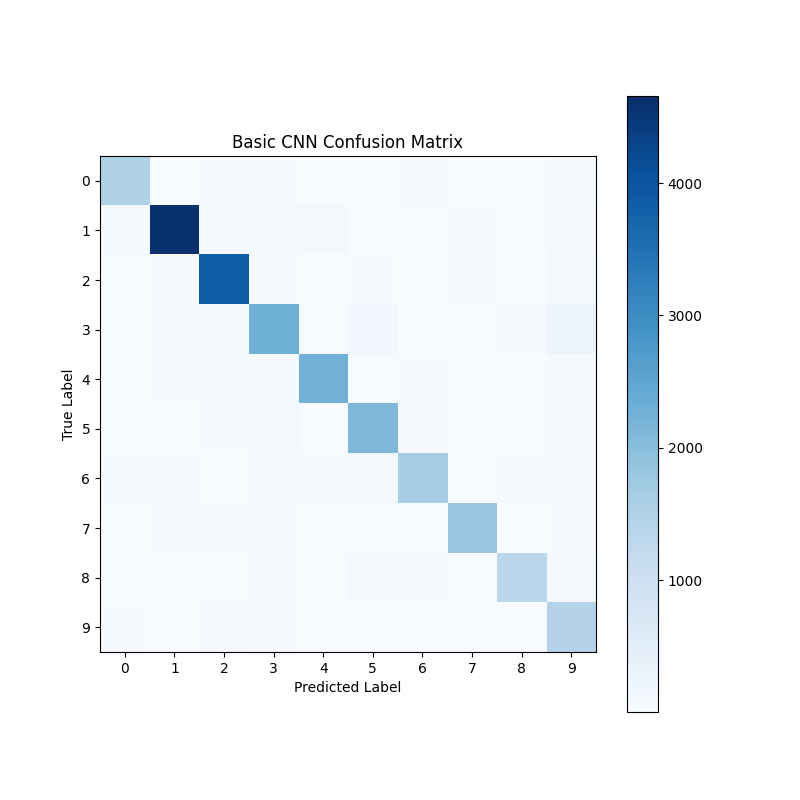
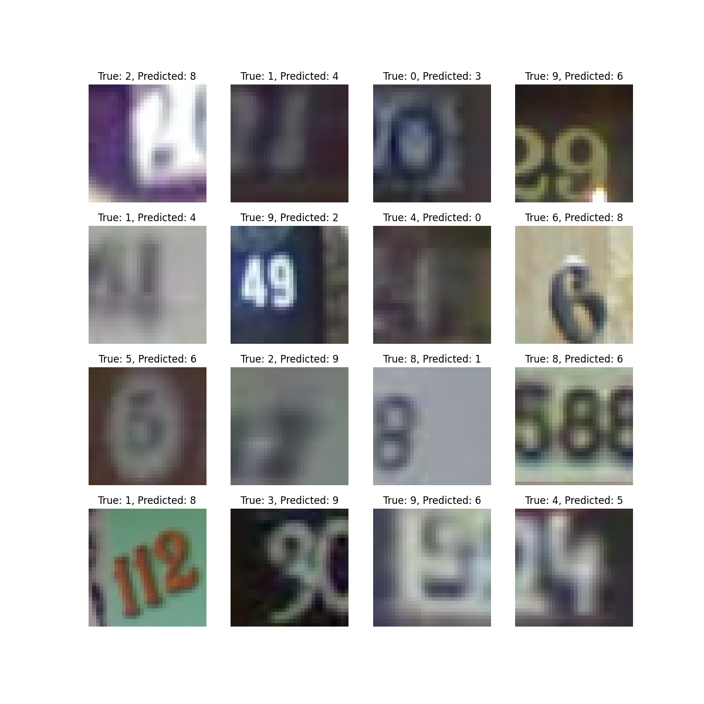

# streetview_cnn
CNN for reading street view images of building addresses.

## Detailed Project Description

This project explores different implementations of convolutional neural networks for the task of reading street view images of building addresses. We used PyTorch to implement an adaptation of the LeNet architecture in addition to a basic exploratory CNN.

## Project Layout

Run `tree streetview_cnn/ -A -L x` in the directory above the project to get the project layout where `-L` is the directory level to go down. An example: 
```
streetview_cnn/
├── README.md
├── Project.ipynb
├── Pipfile
├── Pipfile.lock
├── data
├── models
│   ├── LeNet_cnn.pth
│   └── basic_cnn.pth
└── results
    ├── Confusion_BasicCNN.png
    ├── Confusion_LeNet.png
    ├── Error_Examples_BasicCNN.png
    └── Error_Examples_LeNet.png
```

 - `Project.ipynb`: Notebook used for downloading data, training models, and analyzing results.
 - `data`: Directory for data, will be automatically filled after running `Project.ipynb`.
 - `models`: Directory for saved models.
 - `results`: Directory for resulting plots and analysis of model performance.

## Running the Project

This repository uses Pipenv to manage the virtual environment by using the Pipfile to load all necessary packages. The virtual environment allows anyone to properly run the project and avoid any possible dependency and version issues. You may be able to properly run the project without this virtual environment, but to avoid issues we recommend following the instructions detailed below.

1. Start the virtual environment as specified:
    * NOTE: Our environment uses Python 3.8 so it must be installed if not present on your local machine.
        * https://www.python.org/downloads/release/python-380/
    * NOTE: If pipenv is not installed, it can be installed here:
        * https://pypi.org/project/pipenv/. 
    * Use terminal to navigate into your local copy of the repository, and run `pipenv shell`
2. Open JupyterLab (or any IDE of your choice): 
    * JupyterLab which is already included within the virtual environment so anyone can use this method regardless of what you have installed on your local machine. 
        * Run `jupyter lab` in the terminal that you opened in step 2.
    * You could alternatively use any IDE of your choice, such as VS Code, as long as you ensure the virtual environment is properly activated.
3. Run Project.ipynb:
   * Running the first two cells will download the data and thus fill the ‘data’ folder.
   * NOTE: Running the entire notebook will result in retraining all the models which may take some time depending on your machine
       * You can simply skip the training cells (cell 8 and 12) and just load the models as they are already saved in the ‘models’ folder.
4. Close JupyterLab once you are finished:
    * Press (Control+C) in the terminal window (if using MacOS).
5. You can now close the virtual environment:
    * Run `exit` within the terminal window.
  
## Results & Analysis

Between the two tested models, the variation on LeNet outperformed the basic CNN architecture at an accuracy of 88.9% to 87.67%. We believe this improvement, while marginal, is evidence of a reasonable tradeoff between computational resources and complexity (more fully connected layers in the LeNet model) versus overfitting. 
An interesting aspect of the models to analyze is the misclassification of digits. For one, the most common misclassification was of the digit ‘3’ in both models, as can be seen in the following confusion matrices.
Basic CNN                                    |                                 LeNet CNN
:-------------------------------------------:|:----------------------------------------:
  |  

However, due to the uninterpretable nature of CNN layers, it's hard to pinpoint exactly why exactly that is the case. However, from a qualitative standpoint, the typographical nature of the ‘9’ digit is very similar to the ‘3’ digit, where if the top curve of ‘3’ is close to the center, it can look like a closed loop that forms a ‘9’. Furthermore, the slight increase in saturation of the colors for the LeNet confusion matrix corresponds to the increased accuracy in the model.  

The achieved accuracy also was in line with other models examined during preliminary literature review. This suggests a degree of interoperability of the images at such a small scale and with the phenomena discussed in the introduction. A sample of the misclassified images from the better performing LeNet model can be seen below:

A few commonalities can be observed here. For one, most misclassifications come when there are still multiple digits within the cropped and centered source image. Thus, we can glean that features are detected from the non-centered images that confuse the CNN, leading to a misclassification. Besides that, misclassified images continuing a singular digit are frequently blurry to a degree that even a human would have trouble identifying. The takeaway here is that there is likely an upper bound on the possible accuracy for the dataset as a whole. 


## Contact Details
* Kevin Tang (kevin.tang513@gmail.com)
* Daniel O'Brien (danobr2001@g.ucla.edu)
* Isha Shah (ishashah146@gmail.com)
* Shayan Saadat (ssaadat91@gmail.com)

<!--

Template Notes: 
 - Markdown documentation and cheatsheets:
   - https://www.markdownguide.org/cheat-sheet/
   - https://github.com/adam-p/markdown-here/wiki/Markdown-Cheatsheet
   
-->
